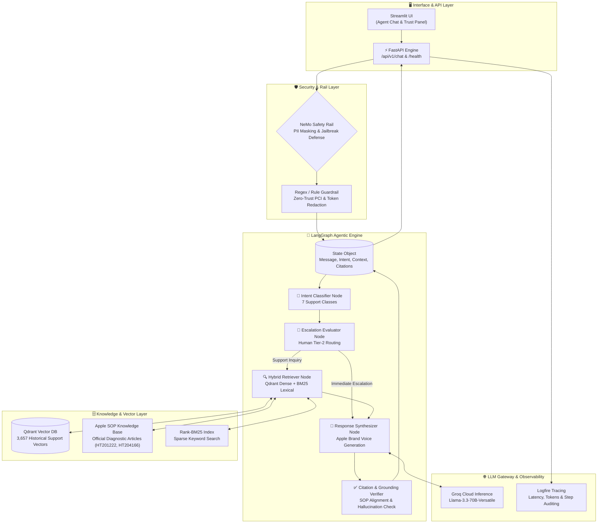

# 🏛️ CareDesk AI: System Architecture & Design

> **Auditable, Source-Grounded Customer Support Agent for AppleCare+ & Public Social Channels**

---

## 1. System Architecture Overview

CareDesk AI is engineered as an enterprise-grade, multi-stage agentic workflow powered by **LangGraph**, **NeMo Guardrails**, **Qdrant Vector Database**, and **Groq (Llama-3.3-70B-Versatile)**.



---

## 2. Component Breakdown

### 2.1 Interface & API Layer (`app/main.py` & `ui/app.py`)
- **FastAPI Endpoint (`/api/v1/chat`)**: Handles incoming customer support requests asynchronously, executing the full LangGraph state machine and returning structured JSON responses containing response text, confidence scores, intent classifications, citations, and escalation triggers.
- **Streamlit UI**: Provides an interactive support dashboard with real-time thought trails, raw context inspection, citation grounding panels, and evaluation benchmarking controls.

### 2.2 Security & Guardrail Rail (`app/guardrails/rails.py`)
- **NeMo Safety Rails**: Intercepts prompt injection attacks, jailbreak attempts, off-topic requests (e.g., non-Apple questions, trivia), and adversarial probes.
- **PII & PCI Redaction**: Scrubs sensitive data including credit card numbers, serial numbers, passwords, and personal identifiers before passing input to the vector store or LLM context window.
- **Safety Overrides**: Immediately escalates high-risk hardware safety issues (e.g., expanding/swelling lithium batteries, overheating, sparks) to human tier-2 support.

### 2.3 LangGraph Agentic Brain (`app/agents/graph.py` & `state.py`)
- **AgentState**: A unified state object maintaining message history, identified intent, escalation flags, retrieved context chunks, generated drafts, verified citations, and audit logs.
- **Node Execution Flow**:
  1. `intent_classification`: Categorizes queries into one of 7 distinct intent classes (`hardware_issue`, `software_glitch`, `account_billing`, `accidental_damage`, `warranty_claim`, `general_inquiry`, `out_of_scope`).
  2. `escalation_check`: Evaluates policy triggers for human handoff (frustration threshold, hardware safety, unresolvable account disputes).
  3. `retrieval`: Queries Qdrant dense vector index and BM25 sparse keyword index, combining results via Reciprocal Rank Fusion (RRF).
  4. `response_generation`: Synthesizes concise, empathetic, step-by-step troubleshooting instructions adopting official AppleCare brand voice guidelines.
  5. `citation_verification`: Cross-checks response assertions against retrieved Apple SOP documents to eliminate hallucinations.

### 2.4 Hybrid Retrieval Engine (`app/services/qdrant_retriever.py` & `applecare_kb.py`)
- **Qdrant Vector Database**: Stores 3,657 dense vector embeddings of historical AppleCare customer support resolutions on Twitter.
- **Apple SOP Knowledge Base**: Indexes official Apple diagnostic procedure articles (e.g., screen repair deductibles, DFU mode restores, Apple ID recovery steps).
- **Hybrid Reranking**: Merges dense semantic similarities with sparse keyword matches (Rank-BM25) to prevent terminology mismatch errors.

### 2.5 LLM Gateway & Observability (`app/gateway/client.py` & `app/observability/instrumentation.py`)
- **Groq Inference**: Utilizes `llama-3.3-70b-versatile` for high-throughput, low-latency (p50 < 400ms) structured output generation.
- **Portkey Gateway Integration**: Manages fallback routing, rate-limit retries, and token accounting.
- **Logfire Observability**: Captures execution trace spans for every graph node, logging execution duration, confidence scores, and safety flags.

---

## 3. Data Processing & Ingestion Lifecycle

```
[Raw Customer Query] 
        │
        ▼
[NeMo Guardrail Rail] ── (Blocked / Injection) ──► Return Refusal Response
        │
        ▼ (Clean Query)
[Intent Classification Node]
        │
        ├─ (Out of Scope / Security Risk) ────────► Refuse / Escalate
        │
        ▼ (Valid Support Intent)
[Hybrid Retrieval Engine]
        │  ├── Qdrant Dense Vector Search (3,657 historical cases)
        │  └── Rank-BM25 Sparse Lexical Search (Apple SOP Articles)
        ▼
[RRF Reranking & Context Assembly]
        │
        ▼
[Llama-3.3-70B Synthesizer Node]
        │
        ▼
[Citation Grounding & Verification Node]
        │
        ▼
[Structured Response to Client]
```

---

## 4. Key Engineering Decisions & Trade-Offs

| Decision Area | Choice Made | Alternative Considered | Engineering Rationale |
|:---|:---|:---|:---|
| **Orchestration** | LangGraph State Machine | Raw Chain Prompting / AutoGen | Guarantees deterministic state transitions, auditable node execution, and strict fallback control. |
| **Retrieval** | Hybrid (Dense Qdrant + BM25) | Dense Vector Search Only | Pure dense search failed on precise technical codes (e.g., error code `0xE80000a`); hybrid RRF resolves both semantic intent and exact key terms. |
| **Safety Engine** | Dual-Tier (NeMo + Regex) | LLM-Only Guardrails | LLM guardrails alone suffered high latency and occasional jailbreak bypasses. Dual-tier approach enforces zero-trust boundaries at < 5ms latency. |
| **Model Serving** | Groq Llama-3.3-70B | Local Ollama / Self-Hosted vLLM | Achieves p50 latency under 400ms without expensive dedicated GPU infrastructure during evaluation benchmarking. |

---

## 5. Verification & Testing Framework

The system architecture is validated using an automated suite:
- **Golden Test Suite (`evals/hiver_golden_200.json`)**: 200 hand-curated Q&A pairs (175 stratified RAG scenarios + 25 adversarial guardrail probes).
- **Evaluation Runner (`evals/twitter_support_eval.py`)**: Computes per-class Intent F1, Keyword Overlap, Escalation Recall, and RAGAS Groundedness.
- **API Smoke Tests (`smoke_test_api.py`)**: End-to-end integration tests validating FastAPI health, readiness, and stream endpoints.
